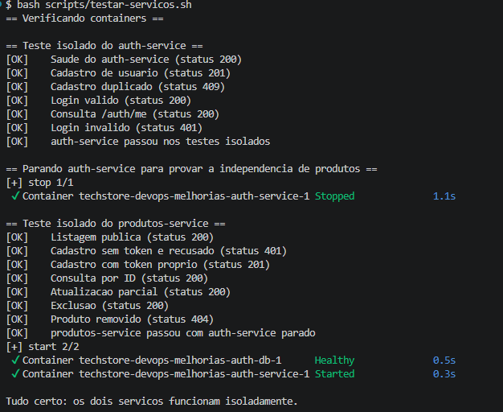
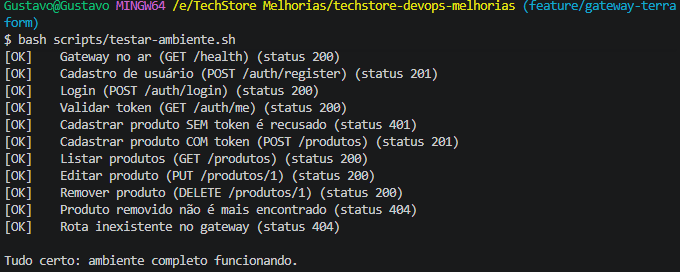
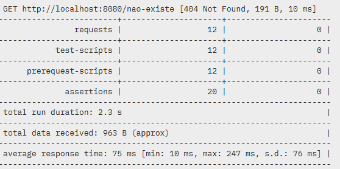
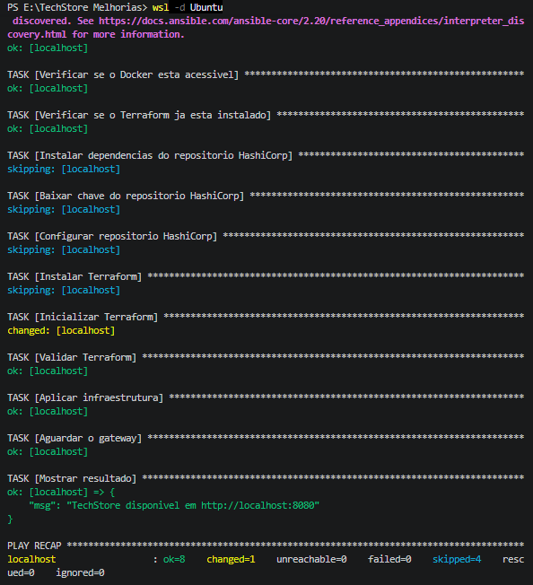

# TechStore — documentação final e evidências de validação

## 1. Identificação do projeto

**Projeto:** TechStore  
**Tema:** evolução de uma aplicação monolítica para uma arquitetura com serviços independentes  
**Equipe:** Gustavo, Artur, Ana Paula e Thiago

## 2. Problema identificado

A versão inicial da TechStore concentrava autenticação, usuários e produtos em uma única aplicação. Essa organização aumentava o acoplamento entre funcionalidades: uma alteração localizada poderia afetar partes não relacionadas, os testes exigiam a execução do sistema inteiro e a evolução de cada módulo não ocorria de forma independente.

O impacto alcançava três grupos principais:

- a equipe de desenvolvimento, que enfrentava manutenção mais lenta e arriscada;
- a plataforma, pois uma falha pontual poderia comprometer o sistema inteiro;
- o usuário final, sujeito à indisponibilidade de várias funções ao mesmo tempo.

## 3. Solução implementada

O projeto separou o sistema em dois serviços de aplicação:

- **auth-service:** cadastro, login, emissão e validação de token JWT;
- **produtos-service:** operações de cadastro, consulta, atualização e exclusão de produtos.

Um **API Gateway Nginx** passou a ser o único ponto de entrada público. Ele recebe as requisições na porta `8080` e encaminha cada rota ao serviço correto. O acesso externo deixa de depender das portas internas dos serviços.

Cada serviço utiliza seu próprio banco PostgreSQL:

- `auth-db`, responsável pelos dados de usuários;
- `produtos-db`, responsável pelo catálogo.

Essa decisão reduz o acoplamento também na camada de dados. Cada serviço controla suas próprias tabelas, credenciais e volume persistente.

## 4. Arquitetura final

```text
Cliente
   |
   v
API Gateway Nginx :8080
   |------------------------------|
   v                              v
auth-service                  produtos-service
   |                              |
   v                              v
auth-db PostgreSQL            produtos-db PostgreSQL
```

Somente o gateway publica uma porta para a máquina hospedeira. Os serviços e bancos permanecem na rede interna do Docker, diminuindo a superfície de exposição do ambiente.

## 5. Tecnologias e decisões técnicas

| Tecnologia | Uso no projeto | Motivo da escolha |
|---|---|---|
| Flask/Python | APIs dos serviços | Implementação simples e adequada ao MVP |
| PostgreSQL | Persistência separada | Banco relacional e isolamento dos dados por serviço |
| Nginx | API Gateway | Roteamento centralizado e ponto único de entrada |
| Docker Compose | Execução local | Reproduz o ambiente completo com poucos comandos |
| Terraform | Infraestrutura como código | Declara containers, redes e volumes de forma reproduzível |
| Ansible | Automação do provisionamento | Valida dependências e executa o Terraform de maneira padronizada |
| Postman | Testes da API | Executa o fluxo completo e registra as asserções |
| Git e GitHub | Versionamento e colaboração | Histórico, branches, pull requests e rastreabilidade |

## 6. Organização do trabalho com Kanban

A fase final foi dividida em cartões independentes para tornar o andamento visível e permitir a validação de cada entrega:

| Issue | Entrega | Critério de conclusão |
|---|---|---|
| #18 | Documentação | Arquitetura, tecnologias, execução, testes e resultados registrados |
| #19 | Coleção Postman | Fluxo completo executado sem falhas |
| #20 | Serviços isolados | Cada API validada separadamente |
| #21 | Comunicação via gateway | Rotas públicas validadas somente pela porta `8080` |
| #22 | Playbook Ansible | Provisionamento concluído e gateway disponível |

O fluxo recomendado no quadro é `A fazer`, `Em andamento`, `Em revisão` e `Concluído`. Um cartão só chega a `Concluído` depois da execução do teste correspondente e do registro da evidência.

## 7. Como executar o ambiente

Na raiz do projeto, crie o arquivo `.env` a partir de `.env.example` e preencha valores locais para as duas senhas de banco e para o segredo JWT. Esses valores não devem ser enviados ao repositório.

```bash
docker compose up -d --build
```

Verifique o gateway:

```bash
curl http://localhost:8080/health
```

Para encerrar:

```bash
docker compose down
```

Para remover também os volumes e reiniciar os bancos do zero:

```bash
docker compose down -v
```

## 8. Testes executados

### 8.1 Serviços isolados — issue #20

Com o ambiente em execução, foi utilizado:

```bash
bash scripts/testar-servicos.sh
```

O teste validou cadastro, login e consulta de usuário no `auth-service`. Em seguida, o serviço de autenticação foi interrompido e o `produtos-service` continuou executando cadastro, consulta, atualização e exclusão com um token gerado para o teste. O resultado comprova que os serviços funcionam isoladamente e que produtos não depende da disponibilidade do serviço de autenticação durante a validação do JWT.



### 8.2 Comunicação via gateway — issue #21

O fluxo público foi validado exclusivamente por `http://localhost:8080`:

```bash
bash scripts/testar-ambiente.sh
```

O roteiro verificou saúde do gateway, cadastro e login, validação do token, proteção das rotas de produto, CRUD completo e tratamento de rota inexistente. Todos os passos retornaram os códigos HTTP esperados.



### 8.3 Coleção Postman — issue #19

A coleção foi executada pelo terminal na pasta `postman`:

```bash
postman collection run "TechStore - Gateway"
```

O resultado registrou **12 requisições**, **12 scripts de teste**, **12 scripts de pré-requisição** e **20 asserções**, sem falhas. A execução completa levou aproximadamente **2,3 segundos**, com tempo médio de resposta de **75 ms** no ambiente local.



### 8.4 Provisionamento com Ansible — issue #22

No Ubuntu pelo WSL, o playbook foi executado dentro da pasta `ansible`:

```bash
ansible-playbook -i inventory.ini playbook.yml
```

O playbook verificou Docker e Terraform, inicializou e validou a infraestrutura, aplicou o Terraform e aguardou a resposta do gateway. A recapitulação terminou com `failed=0` e `unreachable=0`, e a mensagem final confirmou a TechStore disponível em `http://localhost:8080`.



## 9. Resultado consolidado

| Validação | Evidência obtida | Resultado |
|---|---|---|
| Serviços isolados | Auth e produtos testados separadamente | Aprovado |
| Gateway | Fluxo completo pela porta `8080` | Aprovado |
| Postman | 12 requisições e 20 asserções | Aprovado, sem falhas |
| Ansible/Terraform | Provisionamento e verificação do gateway | Aprovado, `failed=0` |
| Bancos separados | Um PostgreSQL e um volume por serviço | Implementado |

As evidências confirmam o objetivo do MVP: os dois serviços podem operar e ser testados de forma independente, enquanto o gateway oferece uma interface única para o cliente. O ambiente pode ser recriado por Docker Compose ou por Terraform, com o Ansible coordenando o provisionamento.

## 10. Práticas DevOps aplicadas

- versionamento por Git e organização do trabalho com issues e Kanban;
- execução reproduzível em containers;
- infraestrutura declarada em Terraform;
- automação do provisionamento com Ansible;
- testes automatizados em shell e Postman;
- configuração por variáveis de ambiente, sem registrar segredos reais;
- validação das mudanças antes da conclusão dos cartões.

## 11. Limitações atuais

- o ambiente demonstrado é local e utiliza HTTP;
- a gestão de segredos ainda depende de variáveis de ambiente locais;
- o MVP não implementa múltiplas réplicas nem escalonamento automático;
- monitoramento, métricas e logs centralizados ainda podem ser ampliados;
- a separação cobre autenticação e produtos, mantendo outros possíveis domínios fora do escopo atual.

## 12. Próximos passos

- publicar o ambiente em uma infraestrutura remota com HTTPS;
- adotar um gerenciador de segredos;
- ampliar observabilidade com métricas, logs e alertas;
- executar testes automatizados em cada pull request;
- preparar múltiplas instâncias dos serviços e balanceamento de carga;
- separar novos domínios somente quando houver necessidade funcional comprovada.

## 13. Conclusão

A TechStore evoluiu de uma estrutura concentrada para uma arquitetura com responsabilidades separadas. O gateway centraliza o acesso, os serviços mantêm lógica e dados próprios, e a infraestrutura pode ser reproduzida por código. Os quatro conjuntos de testes apresentados comprovam o funcionamento do fluxo completo, a independência dos serviços e a automação do ambiente.
